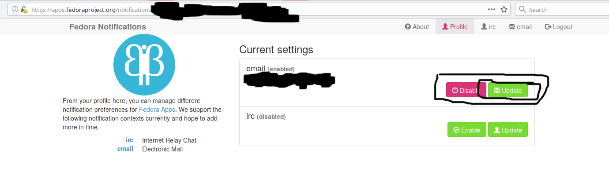
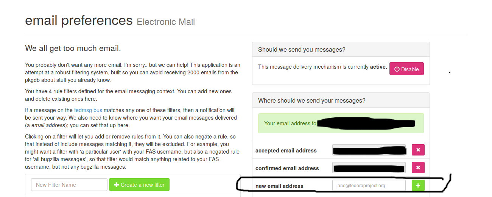
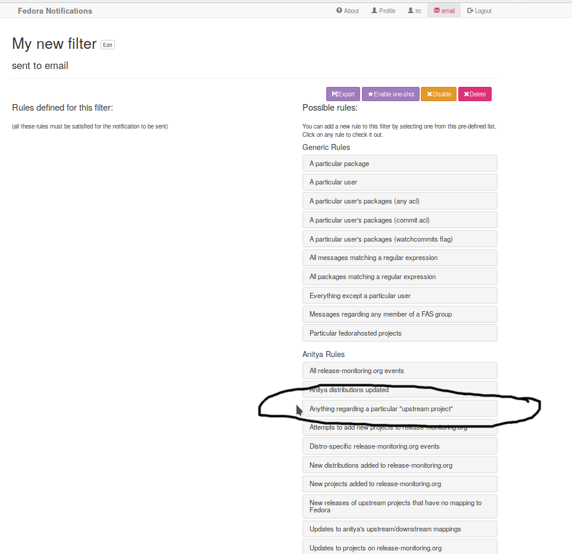

As a maintainer (at least in theory) of some packages in
for a certain package manager ([Nix](https://nixos.org/nix/) and its package
repository [`nixpkgs`](https://github.com/NixOS/nixpkgs)) it's often nice to
have a heads up of when upstream packages have changed so that I can package the
latest versions to have them available for users of the package ecosystem.

I am very bad at this, not least of which because if life gets busy and I forget
to check for new releases of the packages I'm responsible for.

A service that emails me when upstream packages have been updated would be a
godsend and Fedora's [Anitya](https://release-monitoring.org/) is exactly that.
Even though it's part of the Fedora ecosystem, there's nothing about it that is
Fedora specific, other than reusing some of the notification infrastructure that
the Fedora team has set up. You certainly don't need to have anything to do with
`yum` or the Fedora Linux distribution to use it.

Anitya is essentially a repository of various jobs, each configured by
some user, that go out and periodically check and parse a given webpage for new
releases of some project. Anitya comes with a bunch of preset parsers (what it
terms "backends") that users can use to create a job for a new project if Anitya
doesn't already have a job for that project.

Anitya itself takes care of running these jobs as well as broadcasting their
results on Fedora's decentralized messaging system (note it's not clear to me
whether Anitya is using the old Fedora
[fedmsg](http://fedmsg.com/en/latest/overview/) system or whether it's using the
newer [Fedora
Messaging](https://fedora-messaging.readthedocs.io/en/latest/index.html#)
system, for background see
[here](https://fedoraproject.org/wiki/Infrastructure_2020/Fedora_Messaging)).

Unfortunately the process for using it is a bit convoluted. I'm documenting the
steps here for posterity.

1. Find whether Anitya supports the project you're interested in and what name
   it uses for the project by searching on
   [https://release-monitoring.org](https://release-monitoring.org). If it does
   then great (because there's currently over 19,000+ projects on Anitya there's a
   good chance this holds)! Otherwise you'll need to create the job on your own
   [here](https://release-monitoring.org/project/new) using one of the provided
   backends (a good bet is to use the GitHub or GitLab backend since most
   projects are on one of those two platforms and make use of thei release
   infrastructure).
2. Make an account with [Fedora Accounts System
   (FAS)](https://admin.fedoraproject.org/accounts/).
3. Using this account, log into [Fedora
   Notifications](https://apps.fedoraproject.org/notifications). 
   
4. Add your email and add a new filter. It can take a while for a
   confirmation email to come through (it took something like 10-15 min for me).
   Also note that __you won't see any filters or the ability to create filters
   until you confirm at least one email addresss__. 
   
5. Then add Anitya rules to your new filter, the one I usually use is "Anything
   regarding a particular 'upstream project'" and then type in the project names
   I care about. 
   
6. Sit back and wait for the updates to roll in!

As a closing note, the UX for dealing with this seems a bit overwrought.  It
seems like really all you should need to do is submit an email address for a
given project, be sent a confirmation email and then be done with it. No account
creation required. Coming with an alternate publisher for Anitya that's less
general than Fedora Notifications and focused only on Anitya notifications might
be an interesting weekend project for someone to do, since you only need to link
up to Fedora's message broker.
